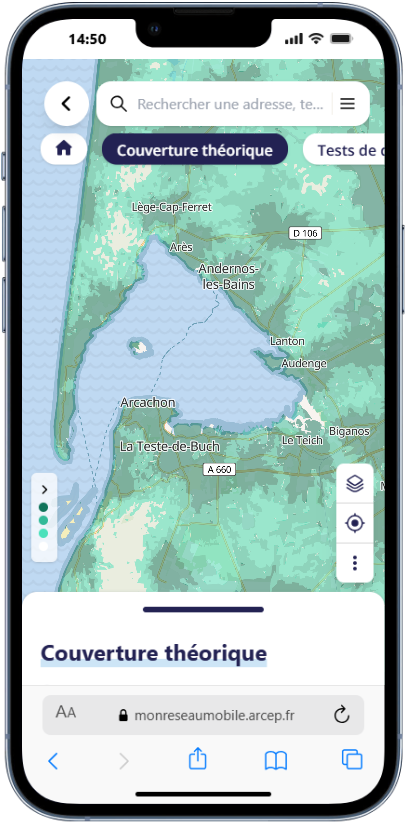
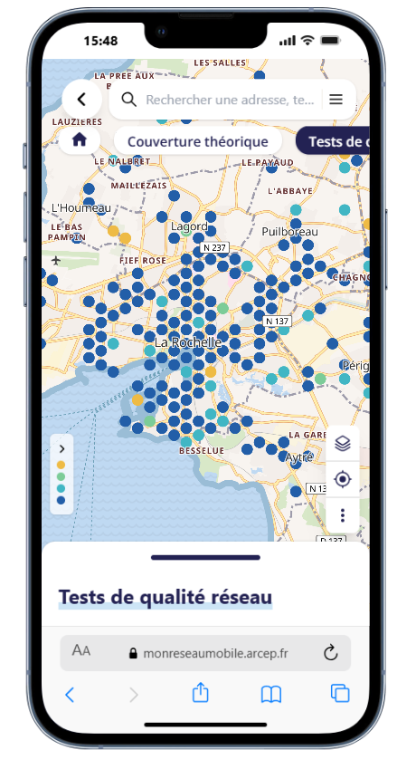
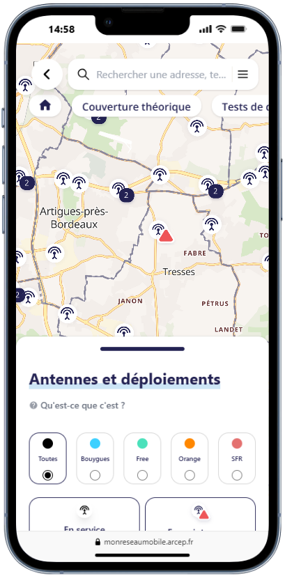
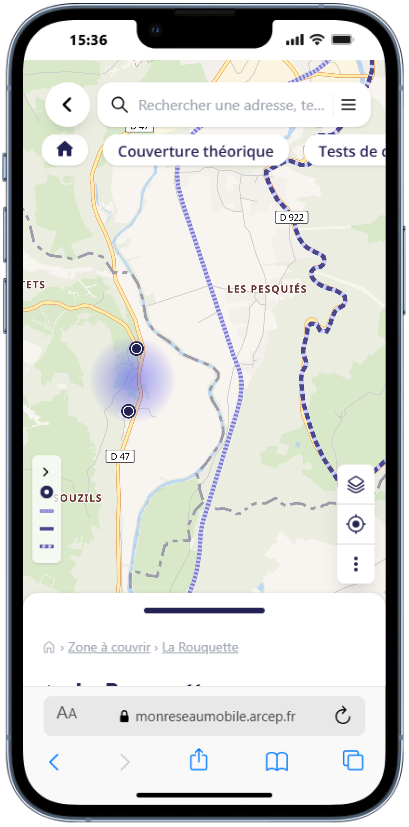
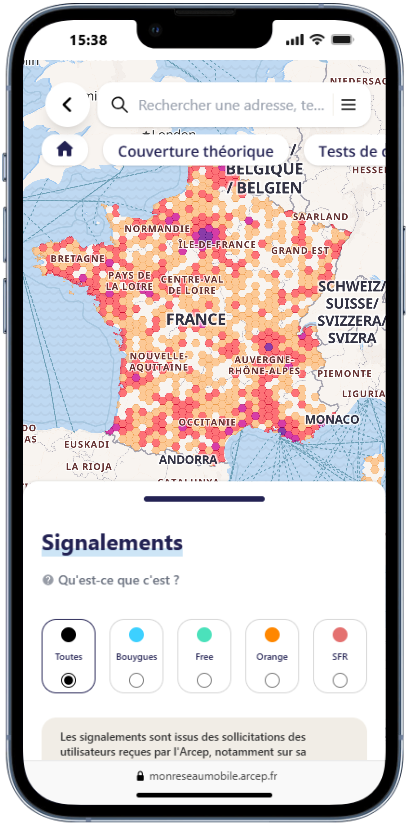

# Mon réseau mobile

**Comparar la cobertura y la calidad de servicio de los operadores móviles en Francia**

[Acceder al servicio](https://monreseaumobile.arcep.fr/) ·
[Reportar un error](../../../../issues) ·

🌍 **Otros idiomas:**
[Français](../../README.md)   [English](../en/README.en.md)

---

## Índice

- [Acerca de](#-acerca-de)
- [Funcionalidades](#-funcionalidades)
- [Capturas de pantalla](#-capturas-de-pantalla)
- [Fuentes de datos](#-fuentes-de-datos)
- [Arquitectura](#-arquitectura)
- [Stack técnico](#-stack-técnico)
- [Accesibilidad y ecodiseño](#-accesibilidad-y-ecodiseño)
- [Seguridad](#-seguridad)
- [Licencias](#-licencias)
- [¿Quiénes somos?](#-quiénes-somos)
- [Créditos y contacto](#-créditos-y-contacto)

---

## ℹ️ Acerca de

**«Mon réseau mobile»** es una herramienta cartográfica editada por la **Arcep** (Autoridad de
regulación de las comunicaciones electrónicas, de los servicios postales y de la distribución de
la prensa). Esta versión corresponde a la disponible desde **agosto de 2025**. **«Mon réseau mobile»**
permite comparar el rendimiento de los operadores móviles en materia de cobertura
(servicios: «Llamadas y SMS» e «Internet móvil») y de calidad de servicio, tanto en el lugar de
residencia como durante los desplazamientos, en la Francia metropolitana y en los territorios de ultramar.

El servicio está dirigido a todos los públicos:

- los **particulares** y las **empresas** que quieren comparar las redes antes de cambiar de operador;
- las **entidades locales** que hacen seguimiento de la evolución del despliegue de las redes móviles en su territorio.

Este repositorio publica el **código fuente** de la aplicación, conforme a la política de apertura
de los códigos fuente de las administraciones (artículo L.300-4 del código de las relaciones entre el
público y la administración). Persigue la transparencia, la reutilización y la contribución de la comunidad.

> ℹ️ Este README describe el proyecto con fines de reutilización. El servicio de referencia sigue
> siendo el publicado por la Arcep: <https://monreseaumobile.arcep.fr/>.

---

## ✨ Funcionalidades

La aplicación muestra, sobre un fondo cartográfico interactivo, varias capas de información
disponibles por operador y por tecnología (2G / 3G / 4G):

- **Mapas de cobertura teóricos**
  - Cobertura de _Llamadas y SMS_
  - Cobertura de _Internet móvil_
- **Pruebas de calidad de red** procedentes de las campañas de mediciones de campo de la Arcep y sus socios
  - Pruebas de _navegación web_
  - Pruebas de _vídeo en línea_
  - Pruebas de _velocidad de descarga_
  - Pruebas de _carga de archivos_
  - Pruebas de _voz_
  - Pruebas de _SMS_
- **Antenas y despliegues**
  - Ubicación de los emplazamientos por operador.
  - Ubicación de los emplazamientos con averías.
- **Zonas por cubrir**
  - _Puntos de interés_ (POI) y zonas identificadas por los poderes públicos.
  - _Ejes viarios prioritarios_ y _ejes ferroviarios_.
- **Reportes** comunicados a través de [« J'alerte l'Arcep »](https://www.arcep.fr/nos-sujets/jalerte-larcep-un-geste-citoyen-pour-ameliorer-les-reseaux-dechange.html).

> ⚠️ La información de cobertura es **simulada** y se facilita a título indicativo, sin valor
> contractual. La cobertura real puede variar según el terminal, la edificación, la meteorología,
> la estación y la carga de la red.

---

## 🖼️ Capturas de pantalla

<table style="width:100%; table-layout:fixed">
  <tr>
    <th>Cobertura móvil</th>
    <th>Calidad de servicio</th>
    <th>Antenas y despliegues</th>
    <th>Zonas por cubrir</th>
    <th>Reportes</th>
  </tr>
  <tr>
    <td></td>
    <td></td>
    <td></td>
    <td></td>
    <td></td>
  </tr>
</table>

Acceder a la aplicación: **<https://monreseaumobile.arcep.fr/>**

---

## 📜 Licencias

- **Código fuente**: publicado bajo **GNU GPL-3.0**. Véase [`LICENSE`](../../LICENSE).
- **Datos**: los conjuntos de datos están bajo licencia abierta (véase el detalle en la página de cada uno en data.gouv.fr).
- **Marcas y logotipos**: logotipo de la Arcep — protegido, excluido de la licencia del código y no reutilizable sin autorización.

---

## 🧰 Stack técnico

- **Cartografía**: MapLibre GL JS, pg_tileserv, teselas vectoriales.
- **Front-end**: Next.js, Tailwind.
- **Back-end**: Django.
- **Datos geoespaciales**: PostgreSQL + PostGIS.
- **Contenedorización y despliegue**: Docker, Ansible.

---

## 🏗️ Arquitectura

---

## 🗂️ Fuentes de datos

Los datos mostrados provienen de fuentes abiertas y de transmisiones reglamentarias de los
operadores. Las principales fuentes públicas reutilizables son:

| Datos | Productor | Acceso |
| --- | --- | --- |
| Mapas de cobertura | Operadores / Arcep | [data.arcep.fr](https://data.arcep.fr/mobile/couvertures_theoriques/) |
| Mediciones de calidad de servicio | Arcep | [data.arcep.fr](https://data.arcep.fr/mobile/mesures_qualite_arcep/) |
| Mediciones de crowdsourcing | Entidades locales / Empresas | [data.arcep.fr](https://data.arcep.fr/mobile/mesures_crowdsourcing/) |
| Antenas y despliegues | Arcep / ANFR | [data.arcep.fr](https://data.arcep.fr/mobile/sites/) · [data.gouv](https://www.data.gouv.fr/datasets/donnees-sur-les-installations-radioelectriques-de-plus-de-5-watts-1) |
| Zonas por cubrir | Arcep / Gobierno | [data.arcep.fr](https://data.arcep.fr/mobile/dispositif_couverture_ciblee/) |
| Reportes de consumidores | Arcep («J'alerte l'Arcep») | No disponible |

Los conjuntos de datos están bajo licencia abierta (véase el detalle en la página de cada uno en data.gouv.fr).
Compruebe la licencia propia de cada conjunto de datos antes de cualquier reutilización.

---

## ♿ Accesibilidad y ecodiseño

Como servicio público digital, la aplicación se ha desarrollado buscando la conformidad con el [RGAA](https://accessibilite.numerique.gouv.fr/)
(Referencial general de mejora de la accesibilidad) y con el [RGESN](https://ecoresponsable.numerique.gouv.fr/publications/referentiel-general-ecoconception/)
(Referencial general de ecodiseño de servicios digitales).
Toda contribución debe velar por no degradar la accesibilidad (navegación con teclado, contrastes,
alternativas textuales, ARIA) ni la sobriedad (peso de los recursos, peticiones de red).

---

## 🔐 Seguridad

Le rogamos que **no** divulgue públicamente una vulnerabilidad de seguridad en una _issue_.
Comuníquela de manera responsable a través del canal indicado en [`/docs/SECURITY.md`](../SECURITY.md) o
mediante la dirección de contacto que figura más abajo.

Dirección de contacto: opendata@arcep.fr

**Mon réseau mobile** es objeto de auditorías de seguridad periódicas y se inscribe en el enfoque
de protección de los sistemas de información propuesto por la ANSSI (Agencia nacional de la
seguridad de los sistemas de información) a través de [MonServiceSécurisé](https://monservicesecurise.cyber.gouv.fr/).
No obstante, pueden subsistir vulnerabilidades.

---

## 🏛️ ¿Quiénes somos?

La Arcep es la «Autoridad de regulación de las comunicaciones electrónicas, de los servicios postales y de la distribución de la prensa»: vela por el acceso a lo digital en Francia, en todas partes, para todos y a largo plazo. Conduce a los operadores a conciliar sus intereses económicos con objetivos de interés general.

**¿Por qué?** Porque el acceso a la fibra, al 4G o al 5G, a una oferta de servicios digitales de calidad y sostenibles, a precios justos en todo el territorio, se ha vuelto esencial para los ciudadanos y las empresas.

**¿Cómo?** La Arcep fija reglas y obligaciones a los operadores para favorecer la competencia, asegurar la ordenación digital del territorio e incentivarlos a invertir en la mejora de sus servicios; recopila y publica información para una mayor transparencia, o utiliza su poder sancionador.

Como Autoridad Administrativa Independiente (AAI), actúa con total independencia respecto al gobierno y a las empresas.

Visite nuestro [sitio web](https://www.arcep.fr/) para más información.

---

## 🙏 Créditos y contacto

- **Editor**: Neogeo Technologies, BAL, 67 All. Jean Jaurès, 31000 Toulouse.
- **Datos de socios**: Entidades territoriales, Speedchecker, Ookla (lista no exhaustiva)
- **Servicio en línea**: <https://monreseaumobile.arcep.fr/>
- **Página de información**:
  [¿Cómo utilizar «Mon réseau mobile»?](https://www.arcep.fr/mes-demarches-et-services/consommateurs/fiches-pratiques/comment-utiliser-mon-reseau-mobile.html)
- **Contacto**: opendata@arcep.fr

—

*«Mon réseau mobile» — un servicio de la Arcep.*

